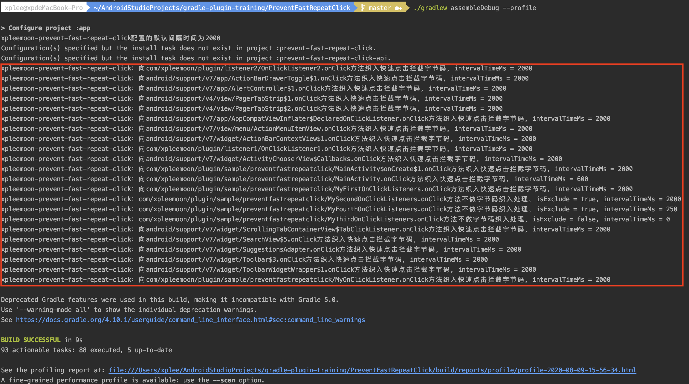
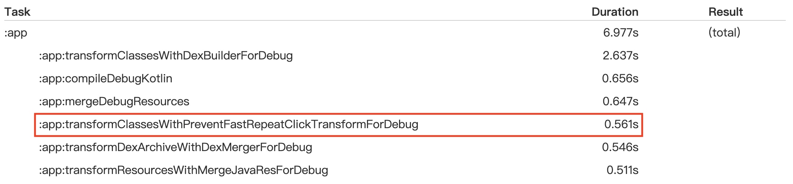
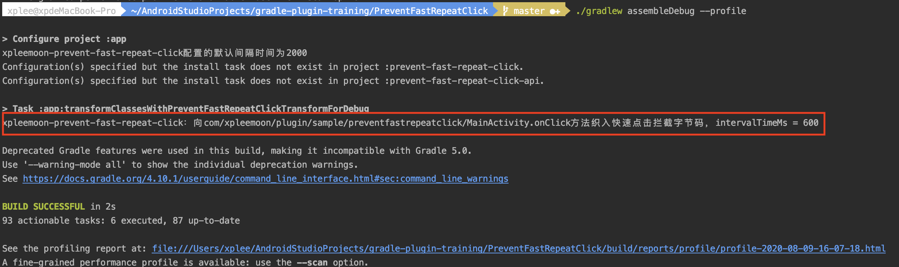
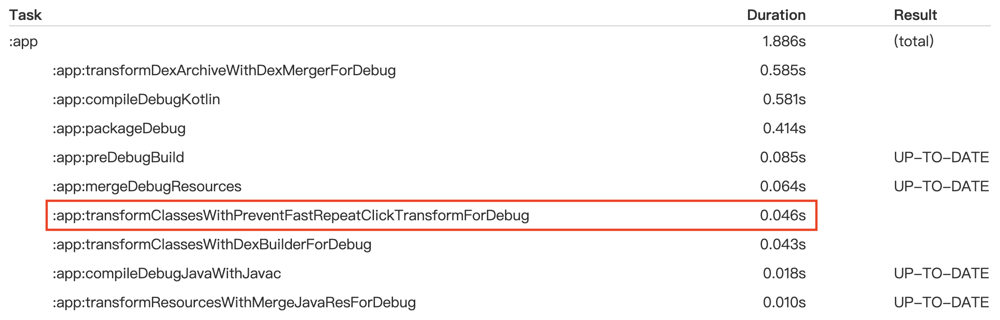
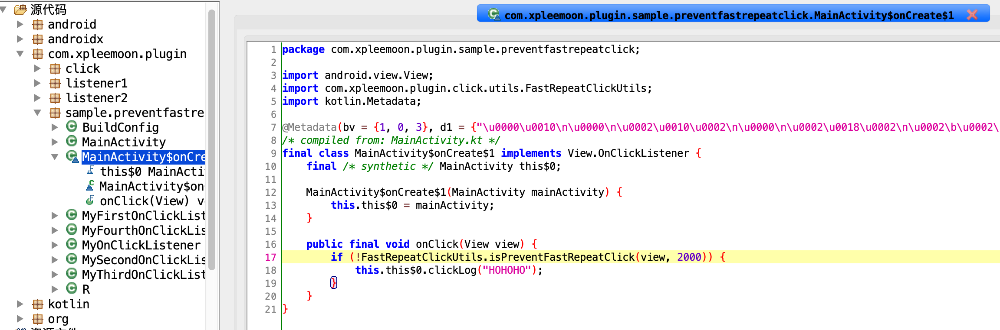

## prevent-fast-repeat-click[](https://www.apache.org/licenses/LICENSE-2.0.html)

SDK|prevent-fast-repeat-click|prevent-fast-repeat-click-api
:---|:---:|:---:
latest version|[  ](https://bintray.com/xpleemoon/maven/prevent-fast-repeat-click/_latestVersion)|[  ](https://bintray.com/xpleemoon/maven/prevent-fast-repeat-click-api/_latestVersion)

在实际项目中，可能会遇到因`View`点击抖动造成的bug。比如有这样一个场景：点击某个`Button`启动`Activity`，但是线上用户可能不小心快速的重复点击了该`Button`（未做防抖的保护），造成`Activity`被重复启动了多次。

碰到类似场景，通常我们只需要对该`Button`做点击防抖的处理即可，但是如果类似的`View`有无数个，那改起来真是一件体力活啊。再假设我们依赖的lib库也有这个状况，由于有些lib库是别人的，源码不在我们这，那我们之前的体力活显然是没法进行了。

针对点击抖动这件小事，为了让开发同学有更好的用户体验，更好的专注在其它重要的迭代中。我们需要提供一种技术方案来保障开发对点击防抖基本无感知，而`prevent-fast-repeat-click`显然就能满足这样的需求。

- `prevent-fast-repeat-click`是一个gradle plugin，用于在app编译的transform阶段，通过[ASM](https://asm.ow2.io)对project中所有的`OnClickListener.onClick()`实现（包括lib库的jar和aar）进行字节码插桩织入。
  - 织入的字节码是关于防止`View`的点击抖动（快速重复点击）。
  - 对于transform采用增量和并发，目的是为了加快处理速度，减少对编译速度对影响。

- `prevent-fast-repeat-click-api`是一个sdk，为`prevent-fast-repeat-click`插件提供防止`View`点击抖动的逻辑判断封装。

### 使用方法

1、在工程目录的`build.gradle`中设置插件依赖：
```groovy
buildscript {
    dependencies {
        classpath 'com.xpleemoon.plugin:prevent-fast-repeat-click:latest_version'
    }
}
```

2、在application module的`build.gradle`引用插件
```groovy
apply plugin: 'xpleemoon-prevent-fast-repeat-click'

dependencies {
    implementation 'com.xpleemoon.plugin:prevent-fast-repeat-click-api:latest_version'
}
```

完成上述两个步骤之后，`prevent-fast-repeat-click`插件即可在编译的时候，对app中的`OnClickListener.onClick()`进行字节码（点击防抖）织入。

> 插件对于防止点击抖动的默认间隔时间设定是500ms，若要更改默认时间或针对某些特定View的点击还有特殊需求（比如设置特定时间或者不拦截），可参考[进阶用法](#进阶用法)

### 进阶用法

通常不同开发者对于view的点击防抖默认间隔时间有不同的要求，那么可以在application module的`build.gradle`设置：
```groovy
prevent-fast-repeat-click {
  	// enableDebugLog表示是否开启调试日志，默认值为true。若开启调试日志，我们将会看到编译过程中输出的日志信息
    enableDebugLog false
    // 更新配置后请先clean，防止APK增量编译导致无法生效
    defaultIntervalTimeMs 2000
}
```

细心的同学会发现上述日志中，有些view的点击我们没有做字节码插桩，而有些view的点击抖动间隔时间又跟默认设置的2000是不一样的。主要是因为考虑到在实际项目中，实际业务场景中可能针对某些特定`View`的点击还有特殊需求，所以这里的插件做了相关的自定义个性化支持，比如设置特定时间或者不拦截。那么这时候我们可以通过使用注解`prevent-fast-repeat-click`来进行标注，而编译的时候，插件会对该注解进行处理。注解`prevent-fast-repeat-click`有两个参数：

- `isExclude`——对所注解的[android.view.View.OnClickListener.onClick]方法是否排除快速拦截的标记，简单的说若取值为true：不做快速点击拦截处理；反之，做快速点击拦截处理
- `intervalTimeMs`——快速点击拦截的间隔时间，优先级高于gradle配置，注意若取值小于等于0，实际也相当于不拦截

```kotlin
class MyFirstOnClickListeners : View.OnClickListener {
    /**
	 * 快速点击拦截，点击的间隔时间为250
	 */
    @prevent-fast-repeat-click(intervalTimeMs = 250L)
    override fun onClick(v: View?) {
        Log.d("info_out", "123456")
    }
}

class MySecondOnClickListeners : View.OnClickListener {
	/**
	 * 不做快速点击拦截，因为isExclude为true
	 */
    @prevent-fast-repeat-click(isExclude = true)
    override fun onClick(v: View?) {
        Log.d("info_out", "123456")
    }
}

class MyThirdOnClickListeners : View.OnClickListener {
    /**
	 * 不做快速点击拦截，因为intervalTimeMs为0
	 */
    @prevent-fast-repeat-click(intervalTimeMs = 0L)
    override fun onClick(v: View?) {
        Log.d("info_out", "123456")
    }
}

class MyFourthOnClickListeners : View.OnClickListener {
    /**
	 * 不做快速点击拦截，虽然intervalTimeMs为250，但是isExclude为true
	 */
    @prevent-fast-repeat-click(isExclude = true, intervalTimeMs = 250L)
    override fun onClick(v: View?) {
        Log.d("info_out", "123456")
    }
}
```

### 编译

为了能够方便查看增量编译的过程，先开启`prevent-fast-repeat-click`插件的日志开关，并执行`./gradlew clean`保证project处于未编译状态。

然后执行`./gradlew assembleDebug --profile`命令，查看`prevent-fast-repeat-click`的全量编译日志和性能报告：





为了更明显地对比增量编译，接下来在业务代码中针对View.OnClickListener增加一个实现或者删除一个实现抑或修改一个实现，反正就是无论你怎么干，只要针对View.OnClickListener即可。老规矩执行`./gradlew assembleDebug --profile`命令，查看增量编译日志和性能报告：





在编译结束后，app/build/transforms/prevent-fast-repeat-clickTransform目录下就能看到相关字节码插桩后的产物。当然也可以直接反编译APK进行查看，最后以demo代码`fast_click_btn.setOnClickListener { clickLog("HOHOHO") }`为例作结束，看下`View.OnClickListener`的lambda表达式在经过插件处理后的样子长什么样，黄色标记处就是`prevent-fast-repeat-click`插件在编译期间进行插入对if语句：



